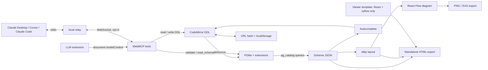
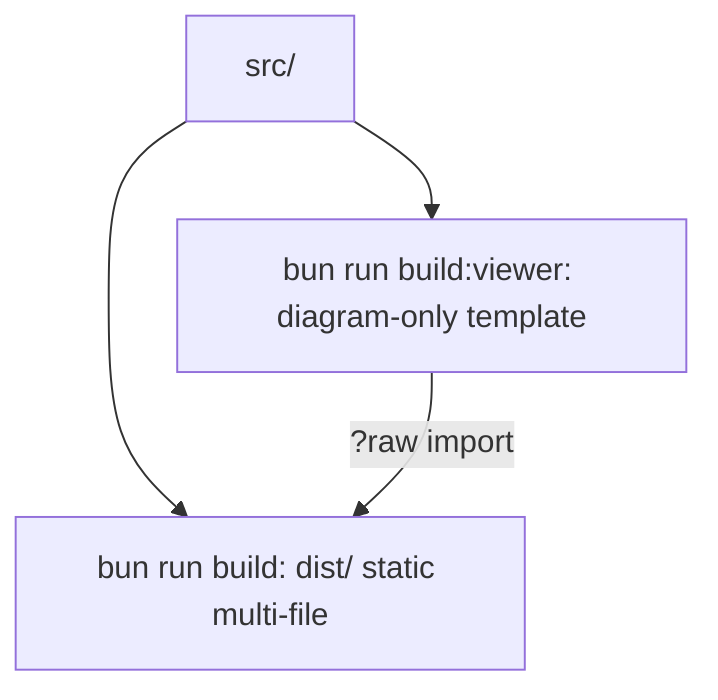

# DESIGN

The WebMCP code (`src/mcp/`), its lazy polyfill and the relay files (`dist/relay/`, only loaded when the user turns on the agent bridge) are never part of the viewer, so they stay out of the HTML export. See [specs/webmcp.md](specs/webmcp.md).

## Build targets

## Bundle notes

There is no single-file app build: inlining the Postgres WASM and data bundle made it ~26 MB, and the diagram-only HTML
export covers that need. `prettier-plugin-sql`'s unused `node-sql-parser` is aliased to a stub (`src/stubs/`).
