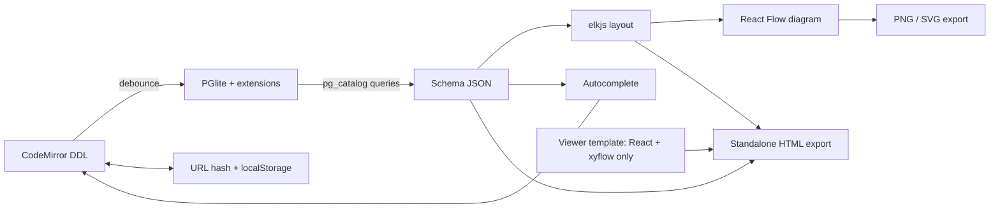
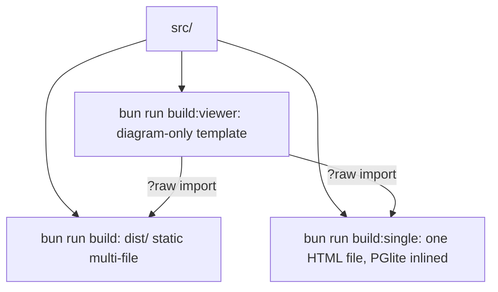

# DESIGN

## Build targets

## Single-file asset handling

PGlite references each big asset (`pglite.wasm`, `initdb.wasm`, `pglite.data`) several times. In the single-file
build `vite-plugins/inlinePgliteAssets.ts` routes all references through one virtual module so each is inlined
once (54 MB → 26 MB). `prettier-plugin-sql`'s unused `node-sql-parser` is aliased to a stub (`src/stubs/`).
