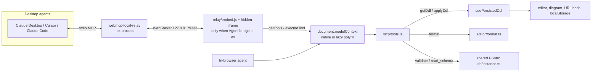

# Support for WebMCP

We add support for [WebMCP](https://github.com/webmachinelearning/webmcp) so people who don't know SQL can edit their
schema with an LLM. The page registers tools on `document.modelContext`; an agent reads and rewrites the DDL and the
diagram updates exactly as if the user had typed it.

Goal: make the tools fully discoverable and executable by AI agents, both **inside the browser** (the WebMCP /
`document.modelContext` standard) and **externally** from desktop agents (Claude Desktop, Cursor, Claude Code) through a
local MCP relay.

## Status

Implemented and verified end to end (dev server and production build, Chrome):

- In-browser registration: polyfill installs lazily, five tools listed, `write_sql` updates editor/URL/diagram, the restore
  bar works, invalid SQL changes nothing, no external requests.
- External agents: a real `@mcp-b/webmcp-local-relay` process plus a scripted MCP client over stdio sees all five tools,
  reads and writes SQL, gets `isError` results for invalid SQL, and turning the bridge off disconnects
  (`node scripts/verify-relay.mjs`).

> The first version of the "part 2" instructions said the tools were not registered with `document.modelContext`. That was
> already implemented (see Architecture); the missing piece was the transport to external MCP clients, which is the agent
> bridge below.

## Decisions

- **Polyfill:** `@mcp-b/webmcp-polyfill` (strict core), lazy-loaded with a dynamic `import()`. Feature-detect native
  `document.modelContext` (canonical) or `navigator.modelContext` (deprecated alias); only initialise the polyfill when
  neither exists. `@mcp-b/global` was considered and not adopted: it only adds the transport for the MCP-B _browser
  extension_, which we do not target.
- **In-browser exposure:** always on. After first paint the polyfill loads and every tool is registered. Permission to call
  tools is the browser's / extension's job.
- **Tool set:** five tools — the four originally proposed (the first draft said "two" but listed four) plus `read_schema`.
- **Overwrite safety:** `write_sql` replaces the whole editor content. The previous DDL is kept in memory and an
  "Updated by AI · Restore previous" bar is shown in the editor pane until dismissed, restored, or the user edits.
- **Errors:** tools throw (reject). The message is Postgres's message prefixed with the line number (`Line 12: ...`) so the
  LLM can self-correct.
- **Semantics the LLM must know** (repeated in the tool descriptions): the editor holds the _complete_ DDL script and it is
  always run against an empty database, so `ALTER` statements only work if the `CREATE` they modify is in the same script.
  Extensions available: `pg_trgm`, `btree_gin`, `btree_gist`, `vector`.
- **Desktop agents:** through `@mcp-b/webmcp-local-relay` (local process, stdio to the agent, WebSocket to the page). The
  bridge is **opt-in** (toolbar toggle "Agent bridge", remembered in localStorage) because turning it on makes the page open
  and keep retrying a WebSocket to `127.0.0.1:9333`.
- **Offline:** the relay's browser embed is vendored from the npm package and served from the app's own origin
  (`relay/embed.js`, `widget.js`, `widget.html`); it is never loaded from a CDN.
- **Not in the HTML export:** the diagram-only export (viewer) never imports the MCP code, the polyfill or the relay files.
- **Single-file app build removed:** it was ~26 MB (mostly the Postgres WASM) and the HTML export covers the use case.
  `bun run build` (static, multi-file) is the only app build.

## Tools

```ts
type MCPTools = {
  /** Returns the DDL currently in the editor (even if it is invalid). */
  read_sql: () => Promise<string>
  /** Formats the SQL (prettier + prettier-plugin-sql, lower-case keywords) and returns it. Does not touch the editor. */
  format_sql: (args: { sql: string }) => Promise<string>
  /** Runs the SQL against a scratch PGlite instance (rolled back). Resolves "DDL is valid."; rejects with `Line N: message`. */
  validate_sql: (args: { sql: string }) => Promise<string>
  /**
   * Validates the SQL as submitted, formats it, then replaces the editor content with the formatted result.
   * Resolves "Wrote N lines to the editor."; rejects (and changes nothing) if validation or formatting fails.
   */
  write_sql: (args: { sql: string }) => Promise<string>
  /** Returns the schema (tables, views, materialized views, partitions, columns, indexes, foreign keys, comments, dependencies) that the current editor DDL produces. */
  read_schema: () => Promise<Schema> // Schema from src/db/types.ts
}
```

Each is registered with a `name`, a `description`, and a JSON-Schema `inputSchema` (`{ sql: string }` for the three that take
input). Descriptions tell the LLM the script is complete and always runs against an empty database. `read_schema` runs a
fresh introspection of the current editor content, so it is accurate immediately after `write_sql` (it is not subject to the
editor's 350 ms debounce).

Result shapes (settled against the polyfill's behaviour): the polyfill JSON-stringifies object results and sends any other
value through `String()`, so a `void`/`undefined` result would reach the agent as the literal text `"undefined"`. Tools
therefore return short confirmation strings instead. Thrown errors reach the agent as
`Tool invocation failed: <message>`, so our `Line N: ...` message survives.

`write_sql` validates the SQL _as submitted_ (before formatting) so the `Line N` in an error points into the agent's own
text, not into a reformatted copy.

Read-only tools (`read_sql`, `format_sql`, `validate_sql`, `read_schema`) carry `annotations: { readOnlyHint: true }`;
`write_sql` does not.

## Architecture



- `db/instance.ts` — one shared PGlite instance used by `useSchema` and the tools (every run is rolled back).
- `db/ddlError.ts` — shared `Line N: message` formatting for the error banner and thrown tool errors.
- `mcp/tools.ts` — pure `createTools(deps)` factory; `mcp/register.ts` — lazy polyfill + `registerTool` with an
  `AbortController` for cleanup; `mcp/useWebMcp.ts` — React hook wiring the latest DDL, `previousDdl` and restore.
- `mcp/relay.ts` + `mcp/useAgentBridge.ts` — load/unload the relay embed; the hook persists the on/off choice.
- `vite-plugins/relayAssets.ts` — serves the relay files in dev and emits them to `dist/relay/`.
- `ui/RestoreBanner.tsx`, `ui/AgentBridgeBanner.tsx` — pure displays for the restore bar and the connect instructions.

## Agent bridge (external MCP clients)

The relay picks up any tools already on `document.modelContext` (it listens for `toolchange` and polls every 2 s), so the
in-page registration needed no change; the bridge only adds the transport.

Use it:

1. Turn on **Agent bridge** in the toolbar (the banner shows these steps).
2. Start the relay: `npx @mcp-b/webmcp-local-relay` (default `ws://127.0.0.1:9333`).
3. Add it to the agent, e.g. Claude Code:
   `claude mcp add webmcp-local-relay -- npx -y @mcp-b/webmcp-local-relay@latest`
   (Claude Desktop: an `mcpServers` entry with `command: npx`, `args: ["-y", "@mcp-b/webmcp-local-relay@latest"]`.)

The agent then sees `webmcp_list_sources`, `webmcp_list_tools`, `webmcp_open_page` plus the five tools above.

Constraints and known limitations:

- The page must be served over http(s) (the embed `fetch`es its widget); `file:` will not work. The app itself needs http
  anyway, so this only matters for the exported diagram HTML, which has no tools.
- The widget reports no connection status to the host page, so the UI cannot show "connected"; it says the page connects
  automatically once a relay is running.
- Requires `document.modelContext` to provide `executeTool`/`getTools`; the polyfill does. A browser's native
  implementation that lacks `executeTool` will not be relayed.
- Removing the embed leaves a harmless 2 s polling timer behind; it only accumulates if the toggle is flipped repeatedly.
- Hosted over https, Chrome may ask for local-network permission before the page can reach `127.0.0.1`.
- Security: any connected agent can read and rewrite the DDL in that tab. The relay accepts any page origin by default; use
  `npx @mcp-b/webmcp-local-relay --widget-origin https://your-host` to restrict it. This is why the bridge is opt-in.

## Verification

- Unit tests: every tool against PGlite, registration with a fake `modelContext`, relay loader with a fake document,
  the relay asset plugin, flag persistence, and the banner/toggle displays.
- Browser: `await document.modelContext.getTools()` lists five tools; `executeTool` on `write_sql` updates editor, URL hash
  and diagram and shows the restore bar; invalid SQL rejects and changes nothing.
- External agents: `URL=http://localhost:5199/ node scripts/verify-relay.mjs` starts a real relay, turns the bridge on in
  Chrome and drives it as an MCP client over stdio (list tools, `read_sql`, `write_sql`, invalid `write_sql`, turn off).
- `grep -c modelContext dist-viewer/viewer.html` and `grep -c relay dist-viewer/viewer.html` are 0; the built app makes no
  external requests, and with the bridge off makes no relay/WebSocket traffic at all.
