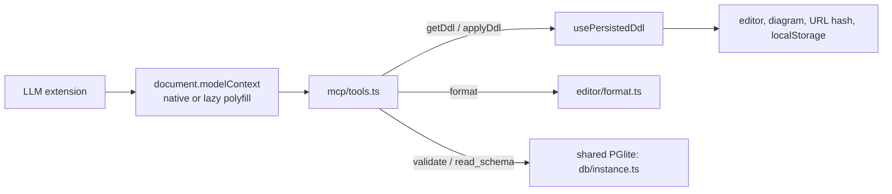

# Support for WebMCP

We add support for [WebMCP](https://github.com/webmachinelearning/webmcp) so people who don't know SQL can edit their
schema with an LLM extension. The page registers tools on `document.modelContext`; the agent reads and rewrites the DDL
and the diagram updates exactly as if the user had typed it.

## Decisions

- **Polyfill:** `@mcp-b/webmcp-polyfill` (strict core), lazy-loaded with a dynamic `import()`. Feature-detect native
  `document.modelContext` (canonical) or `navigator.modelContext` (deprecated alias); only initialise the polyfill when
  neither exists.
- **Exposure:** always on. After first paint the polyfill loads and every tool is registered. Permission to call tools is
  the browser's / extension's job.
- **Tool set:** five tools — the four originally proposed (the first draft said "two" but listed four) plus `read_schema`.
- **Overwrite safety:** `write_sql` replaces the whole editor content. The previous DDL is kept in memory and a
  "Updated by AI · Restore previous" bar is shown in the editor pane until dismissed or restored.
- **Errors:** tools throw (reject). The message is Postgres's message prefixed with the line number (`Line 12: ...`) so the
  LLM can self-correct.
- **Semantics the LLM must know** (repeated in the tool descriptions): the editor holds the _complete_ DDL script and it is
  always run against an empty database, so `ALTER` statements only work if the `CREATE` they modify is in the same script.
  Extensions available: `pg_trgm`, `btree_gin`, `btree_gist`, `vector`.
- **Not in the HTML export:** the diagram-only export (viewer) never imports the MCP code or the polyfill.
- **Single-file app build removed:** it was ~26 MB (mostly the Postgres WASM) and the HTML export covers the use case.
  `bun run build` (static, multi-file) is the only app build.

## Tools

```ts
type MCPTools = {
  /** Returns the DDL currently in the editor (even if it is invalid). */
  read_sql: () => Promise<string>
  /** Formats the SQL (prettier + prettier-plugin-sql, lower-case keywords) and returns it. Does not touch the editor. */
  format_sql: (args: { sql: string }) => Promise<string>
  /** Runs the SQL against a scratch PGlite instance (rolled back). Resolves "DDL is valid."; rejects with `Line N: message`. */
  validate_sql: (args: { sql: string }) => Promise<string>
  /**
   * Validates the SQL as submitted, formats it, then replaces the editor content with the formatted result.
   * Resolves "Wrote N lines to the editor."; rejects (and changes nothing) if validation or formatting fails.
   */
  write_sql: (args: { sql: string }) => Promise<string>
  /** Returns the schema (tables, columns, indexes, foreign keys, comments) that the current editor DDL produces. */
  read_schema: () => Promise<Schema> // Schema from src/db/types.ts
}
```

Each is registered with a `name`, a `description`, and a JSON-Schema `inputSchema` (`{ sql: string }` for the three that take
input). Descriptions tell the LLM the script is complete and always runs against an empty database. `read_schema` runs a fresh introspection of the current editor content, so it is accurate immediately after
`write_sql` (it is not subject to the editor's 350 ms debounce).

Result shapes (settled against the polyfill's behaviour): the polyfill JSON-stringifies object results and sends any other
value through `String()`, so a `void`/`undefined` result would reach the agent as the literal text `"undefined"`. Tools
therefore return short confirmation strings instead. Thrown errors reach the agent as
`Tool invocation failed: <message>`, so our `Line N: ...` message survives.

`write_sql` validates the SQL _as submitted_ (before formatting) so the `Line N` in an error points into the agent's own
text, not into a reformatted copy.

Read-only tools (`read_sql`, `format_sql`, `validate_sql`, `read_schema`) carry `annotations: { readOnlyHint: true }`;
`write_sql` does not.

## Architecture



- `db/instance.ts` — one shared PGlite instance used by `useSchema` and the tools (every run is rolled back).
- `db/ddlError.ts` — shared `Line N: message` formatting for the error banner and thrown tool errors.
- `mcp/tools.ts` — pure `createTools(deps)` factory; `mcp/register.ts` — lazy polyfill + `registerTool` with an
  `AbortController` for cleanup; `mcp/useWebMcp.ts` — React hook wiring the latest DDL, `previousDdl` and restore.
- `ui/RestoreBanner.tsx` — pure display for the restore bar.

## Status

Implemented. Verified in Chrome against both the dev server and the production build (polyfill installs lazily, five
tools listed, `write_sql` updates editor/URL/diagram, restore bar works, invalid SQL changes nothing, no external requests).

## Also in this change

- Removed the single-file app build (`build:single`, `inlinePgliteAssets`).
- The polyfill is a separate lazy chunk in `dist/` and must be absent from `dist-viewer/viewer.html` and exported HTML.

## Verification

- Unit tests for every tool against PGlite, registration with a fake `modelContext`, and the restore banner.
- Browser check: `await document.modelContext.getTools()` lists five tools; `executeTool` on `write_sql` updates editor,
  URL hash and diagram and shows the restore bar; invalid SQL rejects and changes nothing.
- `grep -c modelContext dist-viewer/viewer.html` is 0; the built app serves with no external requests.
